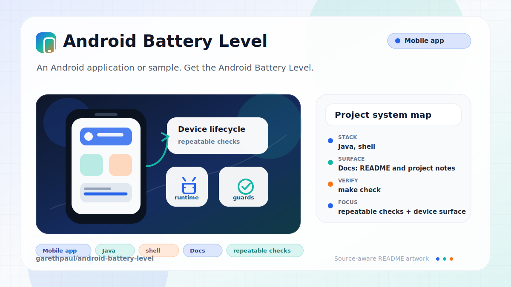

# android-battery-level

<!-- README-OVERVIEW-IMAGE -->


## Overview

`garethpaul/android-battery-level` is an Android application or sample. Get the Android Battery Level. 

This README is based on the checked-in source, manifests, scripts, and repository metadata on the `master` branch. The project language mix found during review was: Java (7), shell (1).

## Repository Contents

- `README.md` - project overview and local usage notes
- `build.gradle` - Android or Gradle build configuration
- `app` - source or example code
- `docs` - source or example code
- `gradle` - source or example code
- `gradlew` - Android or Gradle build configuration
- `scripts` - source or example code
- `SECURITY.md` - security reporting and disclosure guidance
- `VISION.md` - project direction and maintenance guardrails

Additional scan context:

- Source directories: app, docs, gradle, scripts
- Dependency and build manifests: build.gradle, gradlew
- Entry points or build surfaces: Gradle build files
- Test-looking files: app/src/androidTest/java/garethpaul/com/chargeme/ApplicationTest.java

## Getting Started

### Prerequisites

- Git
- Android Studio or a compatible Android SDK
- Gradle or the checked-in Gradle wrapper when present

### Setup

```bash
git clone https://github.com/garethpaul/android-battery-level.git
cd android-battery-level
scripts/check-baseline.sh
./gradlew lint --no-daemon
./gradlew test --no-daemon
./gradlew assembleDebug --no-daemon
```

The setup commands above are derived from repository files. Legacy mobile, Python, or JavaScript samples may require older SDKs or package versions than a modern workstation uses by default.

## Running or Using the Project

- Use Android Studio to open the project or run `./gradlew assembleDebug` when the Android SDK is configured.

## Testing and Verification

- `make check` - runs the source baseline and Android SDK-backed Gradle checks
  when `ANDROID_HOME` is configured
- `scripts/check-baseline.sh` - runs SDK-free battery receiver and resource baseline checks
- The baseline check protects battery level scaling, icon thresholds, receiver
  lifecycle, and voltage unit display. Normalized battery percentages are
  clamped to the 0 through 100 display range before icon threshold selection.
- The battery state and technology fields are populated from Android's battery
  status broadcast instead of leaving first-render placeholders in place.
- `./gradlew lint --no-daemon`, `./gradlew test --no-daemon`, and `./gradlew assembleDebug --no-daemon` when the Android SDK is configured

When the required SDK or runtime is unavailable, use static checks and source review first, then verify on a machine that has the matching platform toolchain.

## Configuration and Secrets

- No required secret or credential file was identified in the repository scan. If you add integrations later, keep secrets out of git.
- The legacy Android build is pinned to Android build-tools 24.0.3 for this baseline.
- Battery voltage is read from Android in millivolts and displayed as volts
  with one decimal place.
- Battery current uses `Unknown` when the device has no supported current
  sensor file.
- Current text-file readers require exact field prefixes before parsing values
  from legacy kernel power-supply files.
- Battery level percentages are normalized against Android's reported scale and
  clamped to 0 through 100 before display.
- Battery state, charging source, health, and technology display text are
  derived from Android battery broadcast extras, with `Unknown` fallbacks for
  missing fields.
- Sticky battery intent helper paths tolerate missing contexts or broadcasts
  and keep display helpers on `Unknown` fallbacks instead of crashing.
- Battery receiver temperature updates ignore missing broadcast intents and
  preserve one-decimal Celsius values for receiver-backed reads.
- The activity guards nullable action-bar access before applying the battery
  icon and hidden-title presentation.
- The checked-in manifest keeps local battery diagnostic state out of Android
  backups by default.

## Security and Privacy Notes

- Review changes touching network requests, sockets, or service endpoints; examples from the scan include app/src/androidTest/java/garethpaul/com/chargeme/ApplicationTest.java, app/src/main/AndroidManifest.xml, app/src/main/java/garethpaul/com/chargeme/BattAttrTextReader.java, app/src/main/java/garethpaul/com/chargeme/CurrentReader.java, and 4 more.
- Review changes touching mobile permissions or privacy-sensitive device data; examples from the scan include docs/plans/2026-06-08-battery-receiver-lifecycle.md, gradlew.
- Review changes touching file, media, JSON, XML, CSV, OCR, or data parsing; examples from the scan include app/lint.xml, app/src/main/AndroidManifest.xml, scripts/check-baseline.sh.
- Review changes touching database, model, or persistence code; examples from the scan include CHANGES.md, app/src/main/java/garethpaul/com/chargeme/CurrentReader.java, app/src/main/java/garethpaul/com/chargeme/MainActivity.java, app/src/main/res/layout/activity_main.xml, and 3 more.

## Maintenance Notes

- This looks like a legacy Android project or sample. Expect Android SDK, Gradle, and support-library versions to matter.
- See `SECURITY.md` for vulnerability reporting and safe research guidance.
- See `VISION.md` for project direction and contribution guardrails.
- See `docs/plans/2026-06-08-battery-check-wrapper.md` for the root
  verification wrapper baseline.
- See `docs/plans/2026-06-09-battery-voltage-display-contracts.md` for the
  voltage display contract.
- See `docs/plans/2026-06-09-battery-actionbar-guard.md` for the nullable
  action-bar guard contract.
- See `docs/plans/2026-06-09-battery-current-display-contracts.md` for the
  current display fallback.
- See `docs/plans/2026-06-09-battery-current-prefix-parsing.md` for the
  current text-file field parsing contract.
- See `docs/plans/2026-06-09-battery-percent-clamp.md` for the battery
  percentage display range contract.
- See `docs/plans/2026-06-09-battery-status-technology-display.md` for the
  battery state and technology display contract.
- See `docs/plans/2026-06-09-battery-backup-policy.md` for the Android backup
  policy contract.
- See `docs/plans/2026-06-09-battery-intent-null-guards.md` for null-safe
  battery intent helper boundaries.
- See `docs/plans/2026-06-09-battery-receiver-temperature-guard.md` for the
  receiver temperature guard.

## Contributing

Keep changes small and tied to the project that is already present in this repository. For code changes, document the toolchain used, avoid committing generated dependency directories or local configuration, and update this README when setup or verification steps change.
